# 10 - Positron V3.2 - Folding
This guide walks you through the procedures of folding the Positron V3.2.

> Original: [LDO Motion Guide](https://ldomotion.com/guides/10---positron-v32---folding)

---
**Previous:** [9 - Final Assembly](9_positron_v32_final-assembly.md)

## 1. Instructions

### Unload the Filament
- Before folding your printer, please remember to unload the filament first. Click Extrude and then Unload.

| | |
|:-:|:-:|
| [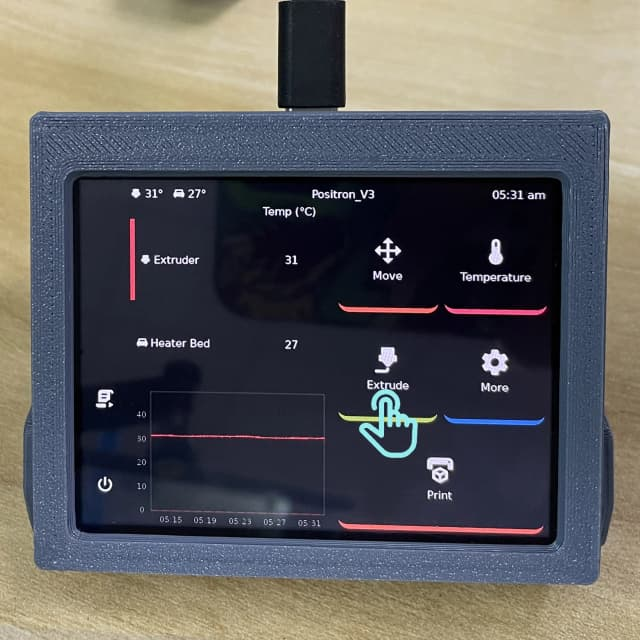](img/10/unload1.png) | [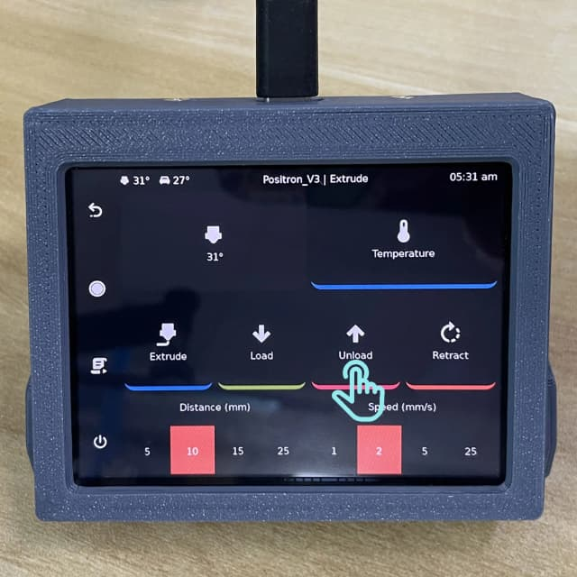](img/10/unload2.png) |

### Remove the Glass Bed
- Remove the glass bed by pulling it outwards.

| | |
|:-:|:-:|
| [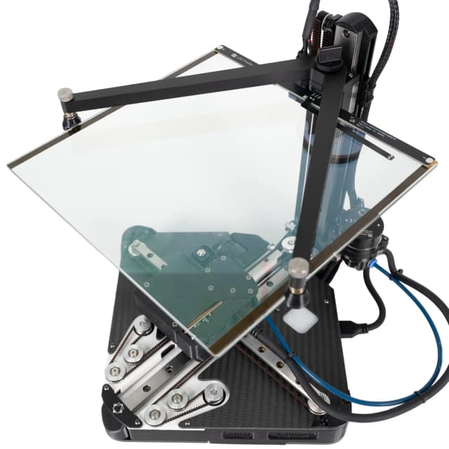](img/10/0001-9.png) | [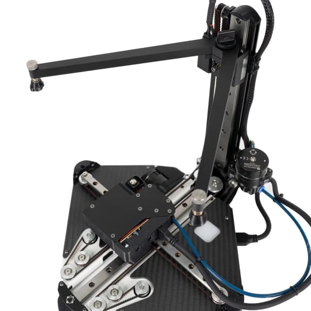](img/10/0002-1.png) |

### Remove the Bed V Holder
- Unscrew the thumb screw and remove the bed V holder.

| | |
|:-:|:-:|
| [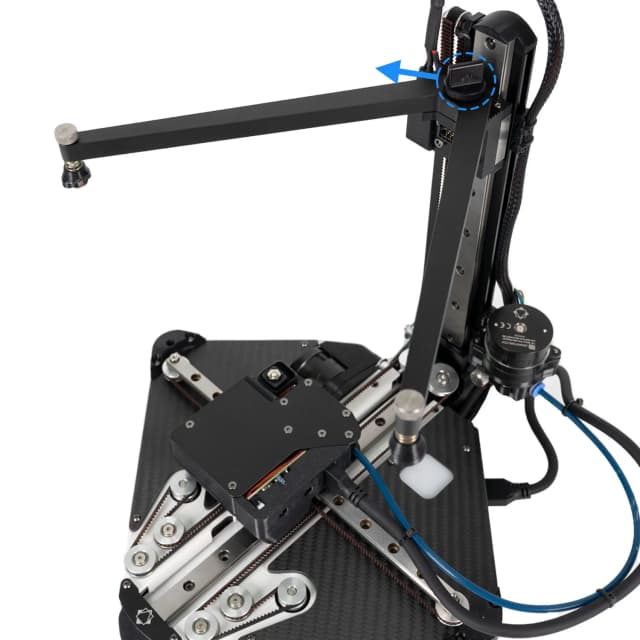](img/10/0003-2.png) | [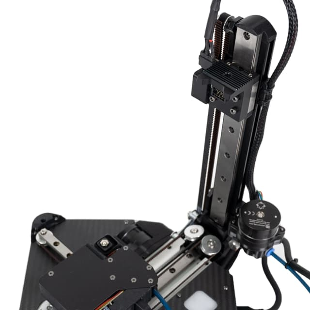](img/10/0004-3.png) |

### Position the Z Idler Latch
- Move the idler latch downward and align it with the linear rail.

| | |
|:-:|:-:|
| [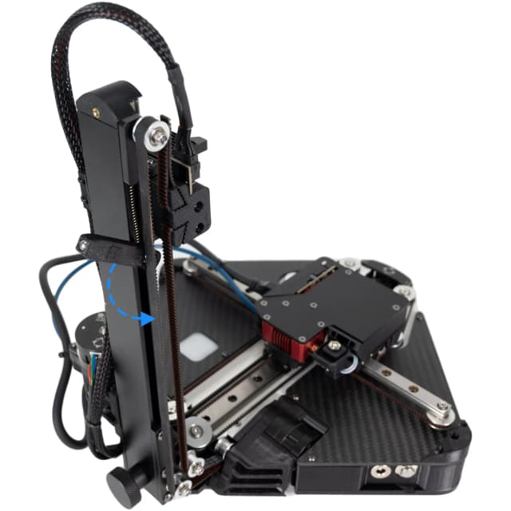](img/10/0005-3.png) | [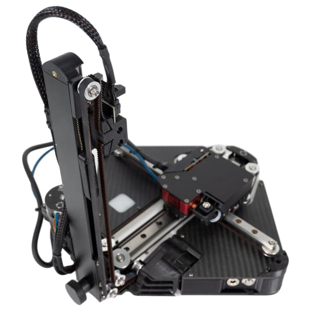](img/10/0006-10.png) |

### Remove the Thumb Screw
- Remove the thumb screw at the bottom of the Z column.

| | |
|:-:|:-:|
| [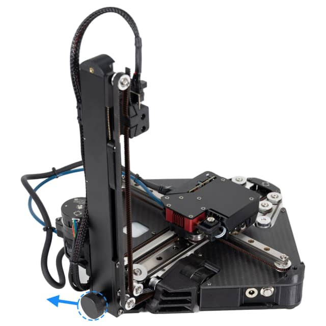](img/10/0007-5.png) | [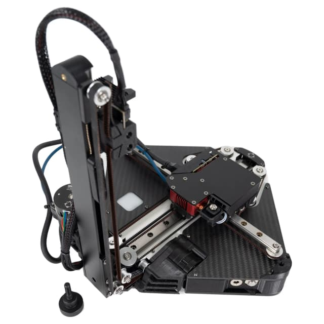](img/10/0008.png) |

### Move the Toolhead and Bed Carriage Block
- Move the toolhead to the right end of the linear rail.
- Move the bed carriage block to the postion close to the third screw as shown in the picture.

| | |
|:-:|:-:|
| [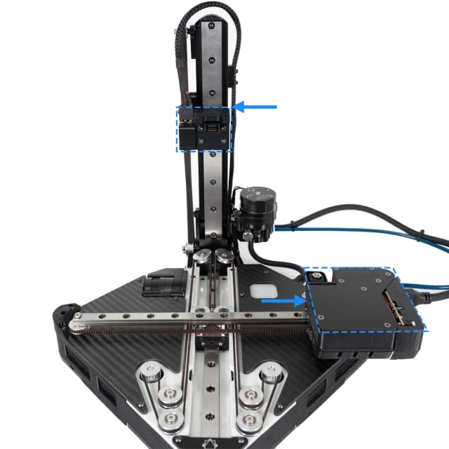](img/10/0009-10.png) |  |

### Position Bed V Holder
- Position the bed V holder as shown in the picture.

| | |
|:-:|:-:|
| [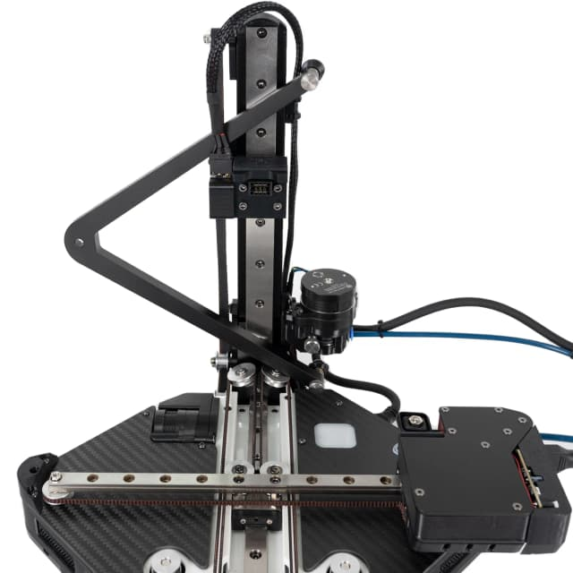](img/10/0010-8.png) |  |

### Fold the Z Column
- Hold the bed V holder with one hand and fold the Z column with the other at the same time.

| | |
|:-:|:-:|
| [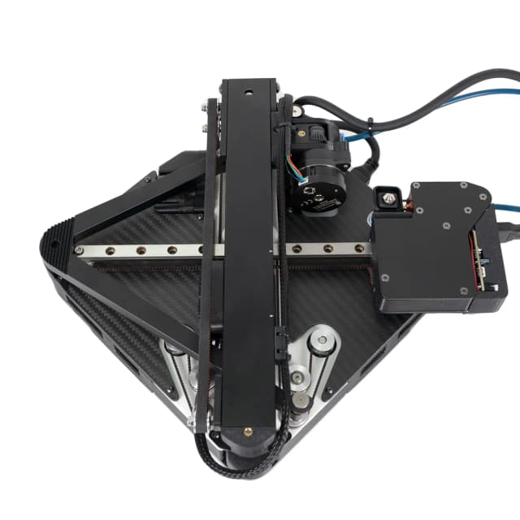](img/10/0011-5.png) |  |

### Move Toolhead to the Z Column
- Move the toolhead back close to the Z column.

| | |
|:-:|:-:|
| [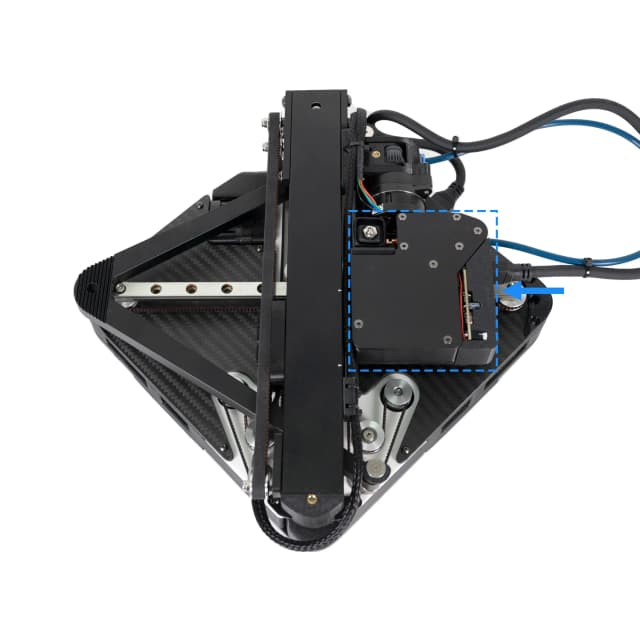](img/10/0012-2.png) |  |

### Position the Screws
- Just put the thumb screws here and don't need to screw them. You can unplug the toolhead cable as it might be in the way of the thumbscrew hole.

| | |
|:-:|:-:|
| [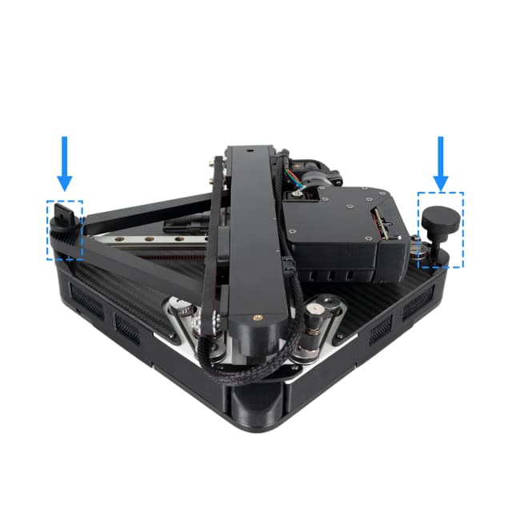](img/10/0013.png) | [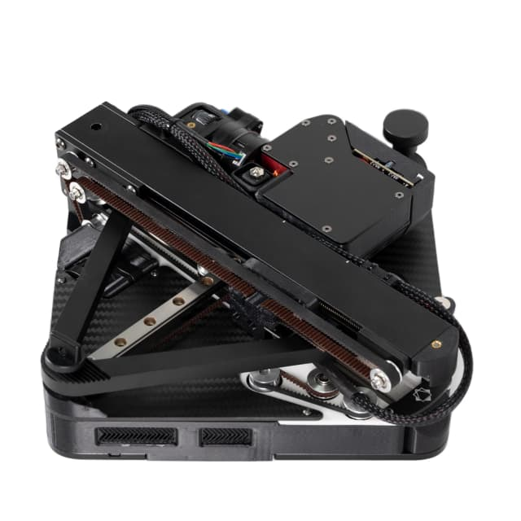](img/10/0015-6.png) |

### A Tip
- Push ahead a little before you unfold the Z column.

| | |
|:-:|:-:|
| [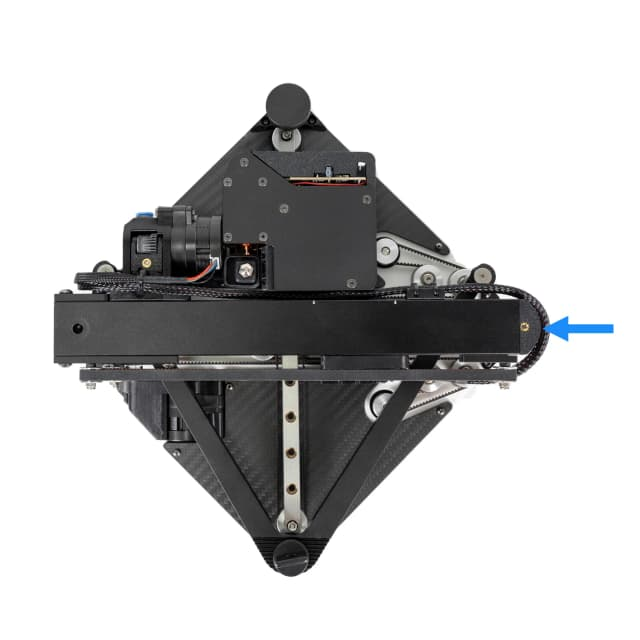](img/10/0014-8.png) |  |
---
**Previous:** [9 - Final Assembly](9_positron_v32_final-assembly.md)
