# 1 - Positron V3.2 - Extruder
This guide walks your through the assembly of the bowden extruder for the Positron V3.2. We also recommend you checking wiki.positron3d.com during the whole build as there are many helpful information.

> Original: [LDO Motion Guide](https://ldomotion.com/guides/1---positron-v32---extruder)

---
**Index:** [README](README.md) &nbsp;|&nbsp; **Previous:** [Heatset Insert Tool](heatset_insert_tool.md) &nbsp;|&nbsp; **Next:** [2 - Z Column](2_positron_v32_z-column.md)

## 1. Parts to Print

> Before you start to assemble, please make sure you have these parts printed.

### Printed Parts
- Extruder Main Body x1
- Extruder Motor Plate x1
- Extruder Bottom Plate x1
- Extruder Guidler x1

| | |
|:-:|:-:|
|  | [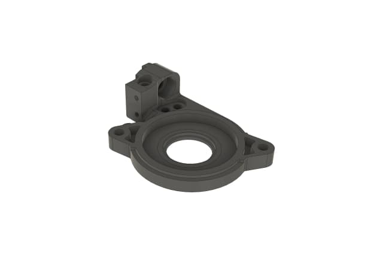](img/1/extruder-motor-plate-1.png) |
| [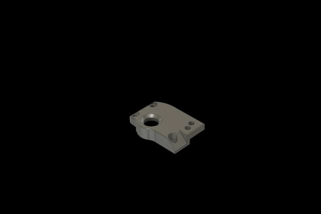](img/1/0018.png) | [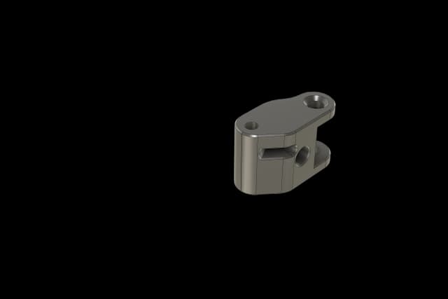](img/1/0028.png) |

### Preparation for the Printed Part
- Install an M3x6x5 heatset insert into the printed guidler.
- Install M2.5x3x4 heatset inserts into the printed extruder main body.

| | |
|:-:|:-:|
| [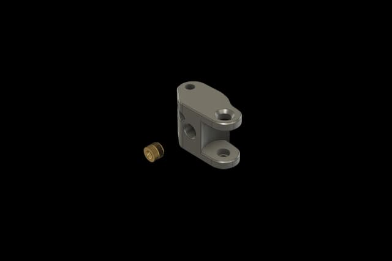](img/1/0009-6.png) | [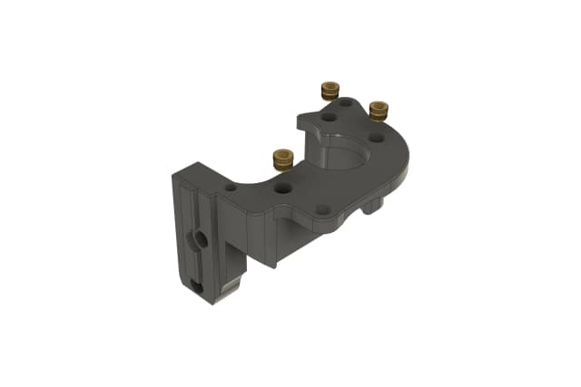](img/1/0-1.png) |
| [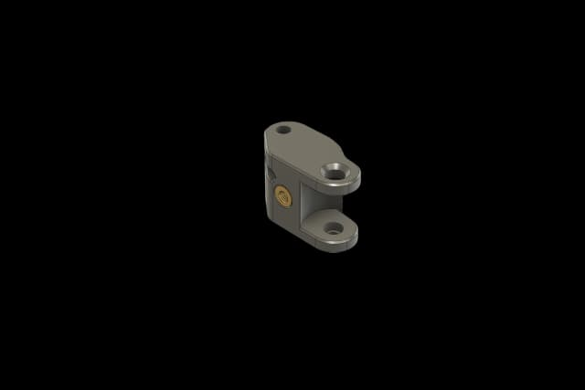](img/1/0009-5.png) | [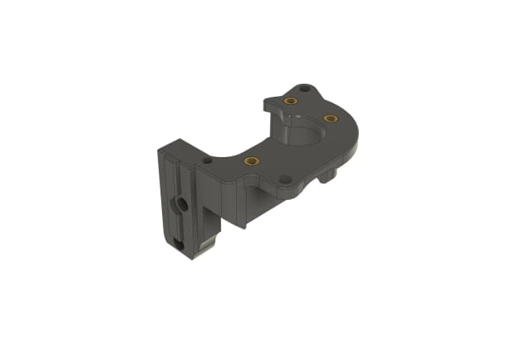](img/1/0-3.png) |

## 2. Installation

> For all the M2.5 screws, please use our screwdriver included in the kit.

### Install the Shaft and Primary Gear
- Place an MF148ZZ bearing into the hole of the printed motor plate.
- Insert the shaft through the hole of the bearing.
- Place the primary gear onto the shaft. Install an M3x3 set screw to the shaft on the flat side. (The set screw should be pre-applied with Threadlocker.)
- Put an MR148ZZ bearing on top of the gear. Pay attention that the top of the shaft and the bearing should be flush.

| | |
|:-:|:-:|
| [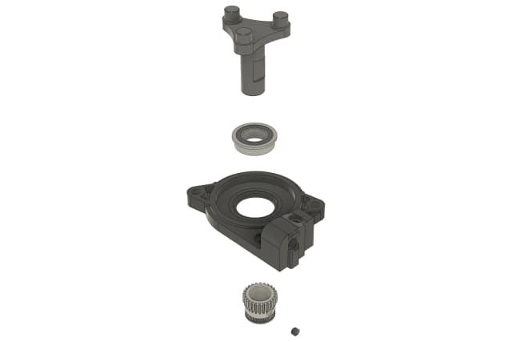](img/1/01-3.png) | [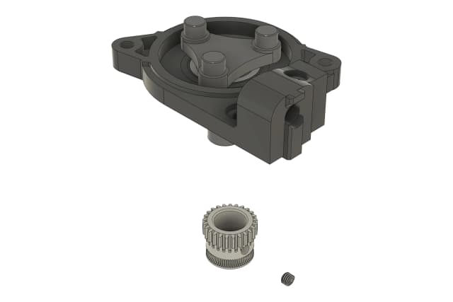](img/1/03-1.png) |
| [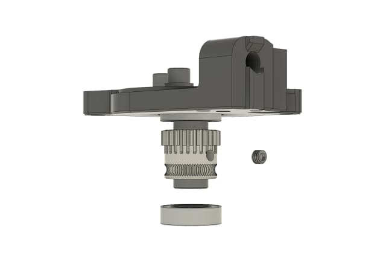](img/1/04-1.png) | [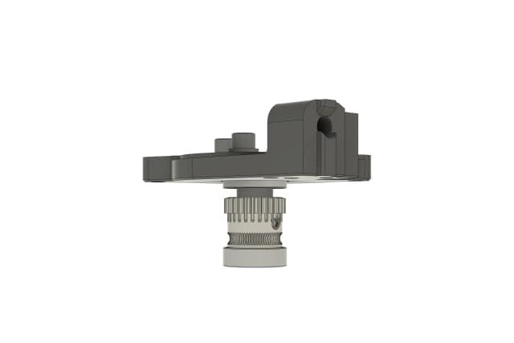](img/1/06-2.png) |
| [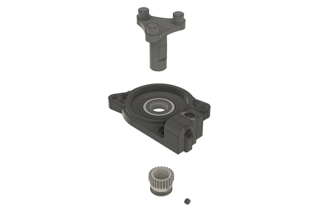](img/1/02.png) | [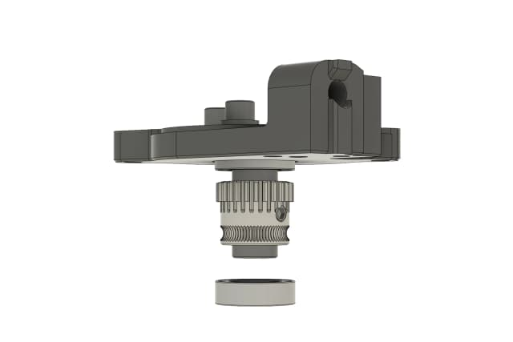](img/1/05-2.png) |

### Install the Bottom Plate
- Combine the extruder motor plate and main body.
- Cover the main body with the bottom plate and secure with M2.5x18 BHCS screws (tap directly into the holes).

| | |
|:-:|:-:|
| [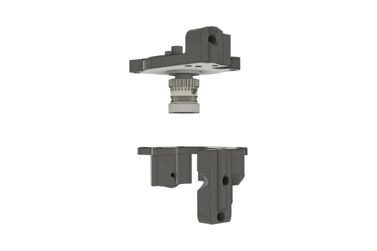](img/1/07-1.png) | [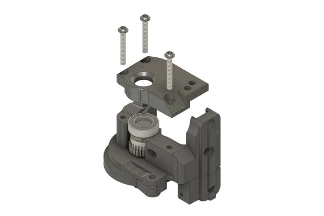](img/1/09.png) |
| [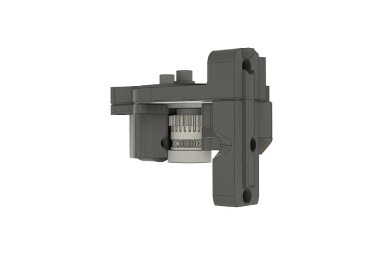](img/1/08-1.png) | [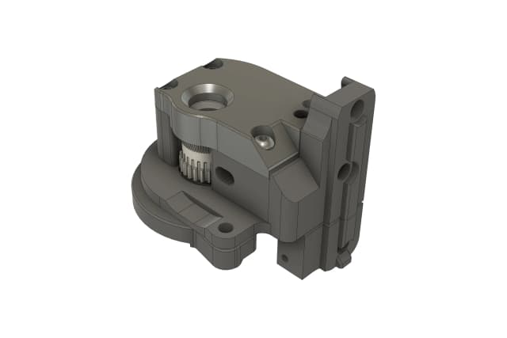](img/1/10-1.png) |

### Prepare the Extruder Guidler
- Place the bushing into idler gear.
- Position the idler gear into the guidler and secure with the 4x16 shaft.

| | |
|:-:|:-:|
| [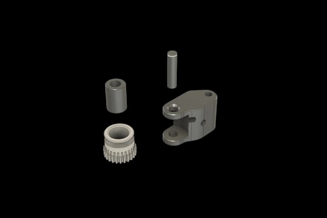](img/1/0009-11.png) | [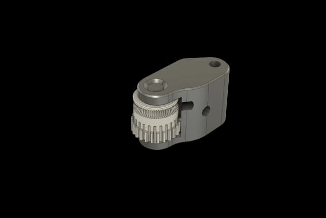](img/1/0009-3.png) |
| [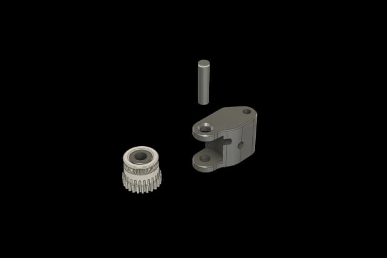](img/1/0009-8.png) |  |

### Check the Filament Path
- Use a piece of filament to check if the holes and the primary gear line up.

| | |
|:-:|:-:|
| [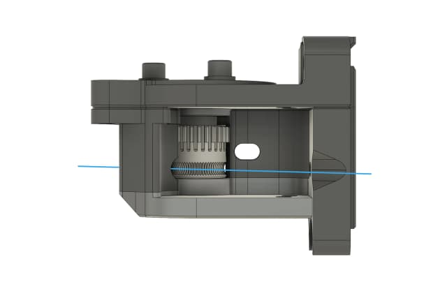](img/1/11.png) |  |

### Install the Extruder Guidler
- Position the guidler into the main body. Secure with an M3x25 BHCS screw (tapped directly into the hole) as shown in the picture.
- Use an M2.5x18 BHCS screw (tapped directly into the hole) as shown in the picture.

| | |
|:-:|:-:|
| [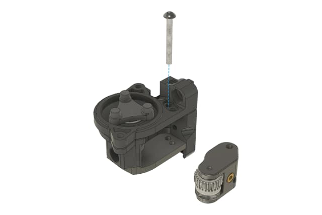](img/1/12-1.png) | [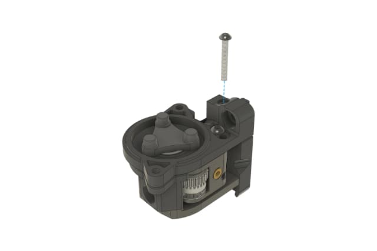](img/1/13-1.png) |
| [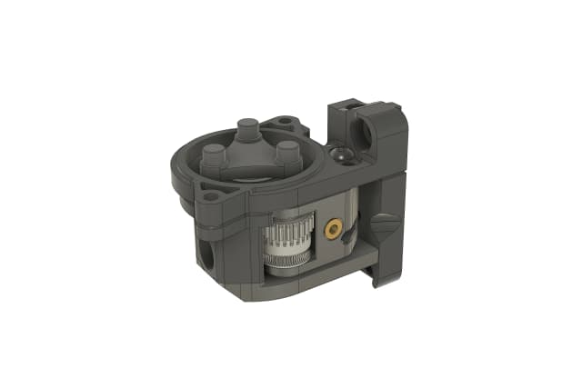](img/1/13.png) | [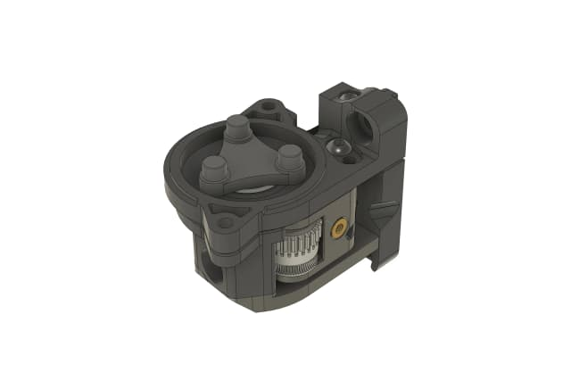](img/1/13-2.png) |

### Install the Bowden Coupler
- Remove any rubber from the Bowden Coupler and then Install it into the extruder. The coupler flange should be flush with the extruder body

| | |
|:-:|:-:|
| [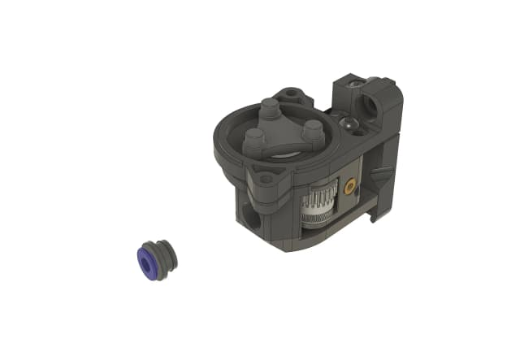](img/1/bowden-coupler.png) | [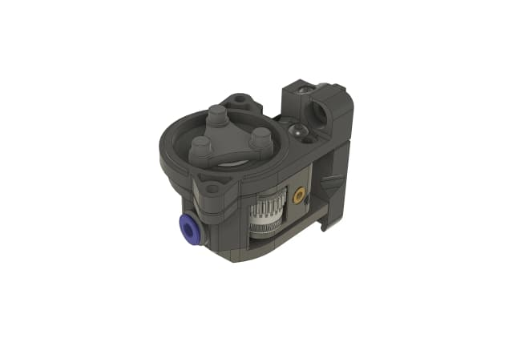](img/1/15.png) |

### Install the Thumbscrew
- Thread a washer (in fastener kit) and a 1x5.9x11.3 spring through the M3x30 thumbscrew and install the thumbscrew into the printed part.

| | |
|:-:|:-:|
| [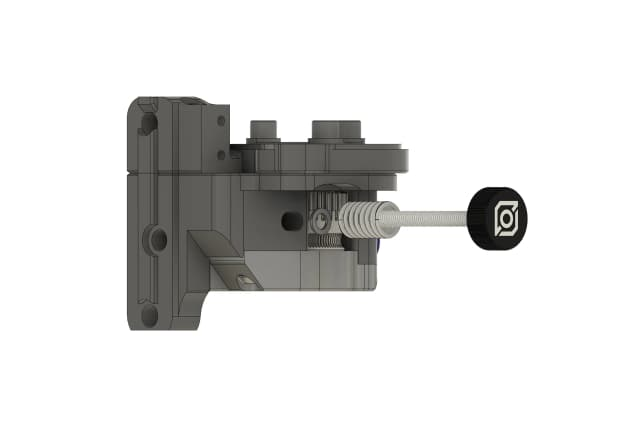](img/1/16.png) | [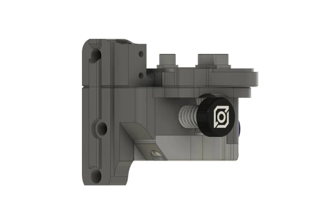](img/1/17.png) |

### Install the Endstop
- Secure the endstop to the printed part using two M2x10 self-taping screws.
- Wires should go between the motor. You may have to bend the wires as they are soldered straight which makes this a bit difficult.

| | |
|:-:|:-:|
| [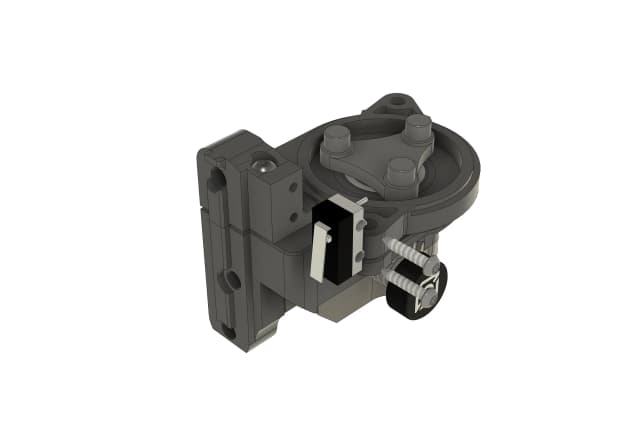](img/1/18.png) | [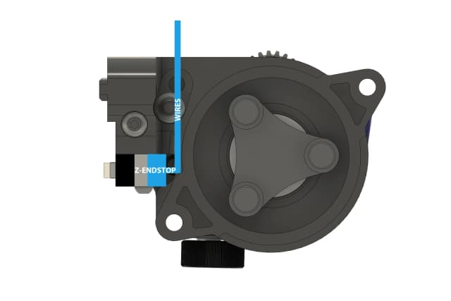](img/1/20.png) |
| [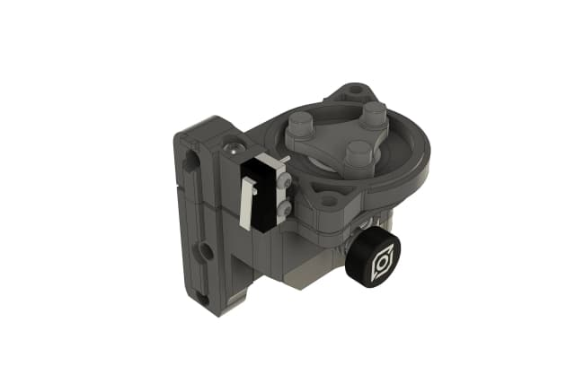](img/1/19-1.png) |  |

### Assembly Complete
- You now have completed the assembly of the extruder.
- We will install the motor and the rest of the planetary gearbox in a later step.

| | |
|:-:|:-:|
|  |  |
---
**Index:** [README](README.md) &nbsp;|&nbsp; **Previous:** [Heatset Insert Tool](heatset_insert_tool.md) &nbsp;|&nbsp; **Next:** [2 - Z Column](2_positron_v32_z-column.md)
