# 2 - Positron V3.2 - Z Column
In this guide we will build the Z column for the Positron V3.2.

> Original: [LDO Motion Guide](https://ldomotion.com/guides/2---positron-v32---z-column)

---
**Previous:** [1 - Extruder](1_positron_3.2_extruder.md) &nbsp;|&nbsp; **Next:** [3 - Z Drive](3_positron_v32_z-drive.md)

## 1. Parts to Print

> Before you begin, please make sure you have these parts printed.

### Printed Parts
- Z Top Stopper x1
- Z PCB Spacer x1
- Z Belt Tensioner Block x1
- Z Tension Arm x1
- Z Tension Pivot x1
- Z Tension Stop x1
- Z Tension Plug x1
- Edge Connector Alignment Tool x1
- Z Rail Alignment Jig x2
- Bed Cable Guide x1

| | |
|:-:|:-:|
| [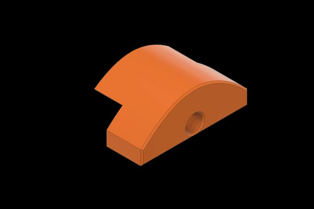](img/2/0001-37.png) |  |
| [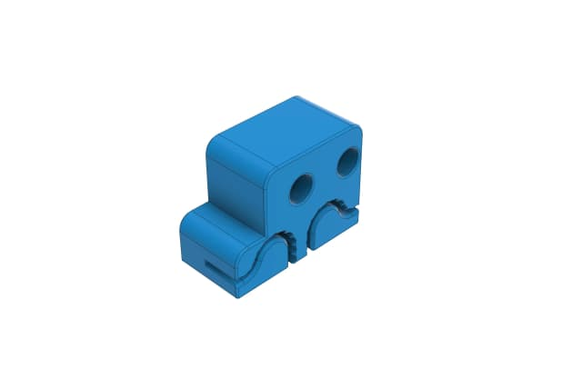](img/2/z-belt-retainer-1.png) | [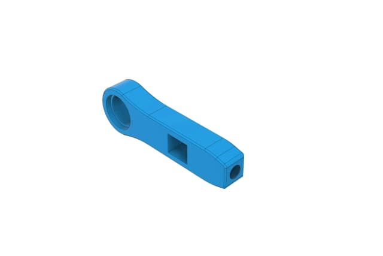](img/2/z-tension-arm.png) |
| [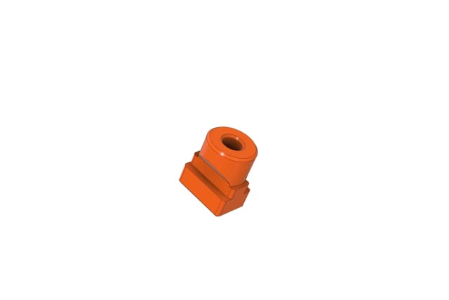](img/2/z-tension-pivot.png) | [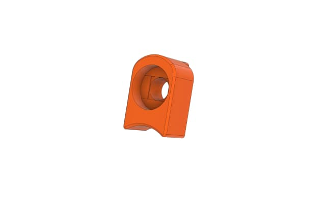](img/2/z-tension-stop.png) |
|  | [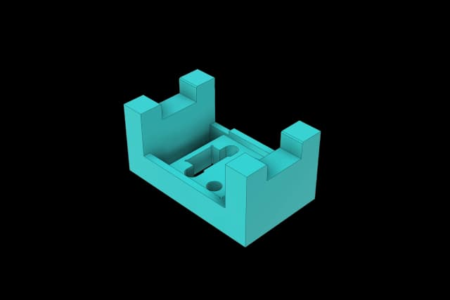](img/2/001-8.png) |
|  | [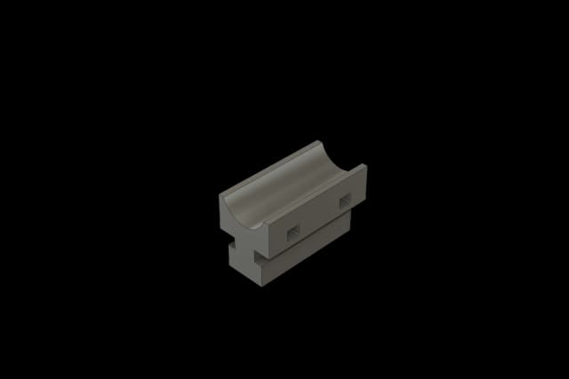](img/2/0107-3.png) |

### Preparation for the Printed Part
- Install an M3x4x5 heatset insert into the hole of the printed top stopper.

| | |
|:-:|:-:|
| [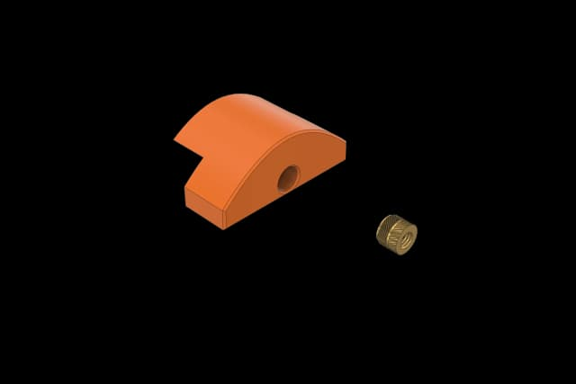](img/2/0001-0.png) |  |

## 2. Installation

> For all the M2.5 screws, please use our screwdriver included in the kit.

### Assembling the Left Z Joint Plate
- Insert two M3x18 FHCS screws into the holes of the left Z joint plate.
- Thread an M3 hex nut and a 6mm idler through each screw (on the opposite side of the plate). Ensure the hex nuts are tightened snug against the plate so that the two screws are rigidly secured.
- An small M3x5 dowel pin is pre-installed on the plate when you receive the left Z joint plate.
- Secure the ends of each screw with M3 nylock nuts. Make sure not to overtighten the nylock nuts, as we need to ensure the that idler wheels spin freely.

| | |
|:-:|:-:|
| [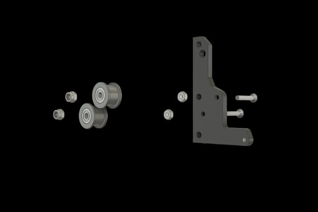](img/2/0001-58.png) | [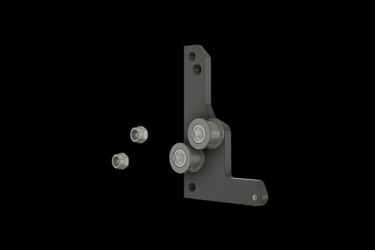](img/2/0001-40.png) |
| [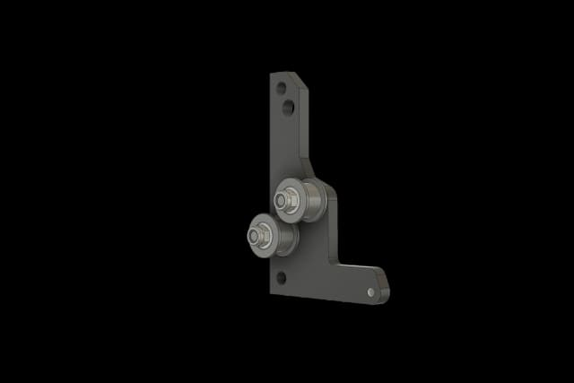](img/2/0001-45.png) |  |

### Assembling the Z Idler Latch
- Insert a 6mm bearing ball into the hole of the tension arm. Let it fall into the hole so that it slightly protrudes from the end of the arm.
- Insert a 0.7x5x10mm spring into the hole. This provides a spring force that keeps the ball bearing protruding outwards.
- Plug the hole with the plug. There should be enough friction to keep the plug fixed in place. You may choose use some super glue for further security. However, make sure the glue does not seep into the spring or bearing ball.
- Here is a transparent perspective for your reference. Let's test the tension arm - when you push against the bearing ball at the end, it should depress freely backwards. Once released, the ball should spring forward into it's original position.

| | |
|:-:|:-:|
| [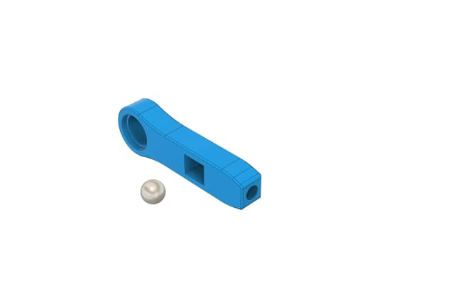](img/2/tension-arm-01.png) | [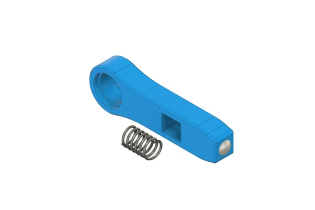](img/2/tension-arm-02.png) |
| [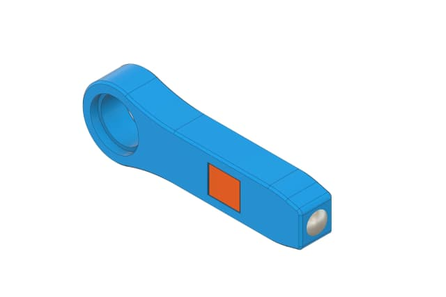](img/2/tension-arm-03.png) | [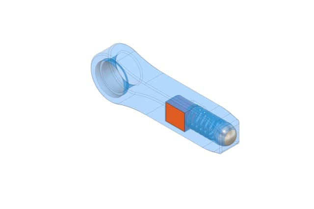](img/2/tension-arm-04.png) |

### Prepare the Z Sliding Idler Block
- Insert an M3x18 FHCS screw into the hole of the Z sliding idler block. Add a 6mm idler.
- Secure the end with an M3 nylock nut. Once again, make sure not to overtighten the nylock nut and ensure the idler wheel spins freely.

| | |
|:-:|:-:|
| [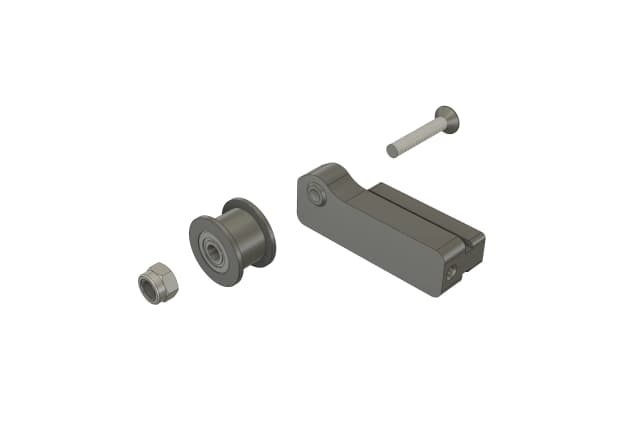](img/2/00.png) | [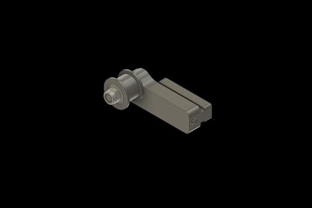](img/2/0001-52.png) |

### Prepare the Bed Carriage Block
- Combine the bed carriage block, bed breakout PCB and printed edge connector alignment tool.
- Use two M2.5x6 FHCS screws to secure the PCB onto the bed carriage block.
- Add the printed PCB spacer to the back of the PCB.
- You can use a small piece of tape to keep the PCB spacer in place so it will be easier to install.

| | |
|:-:|:-:|
| [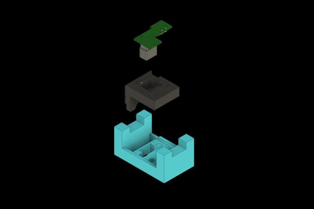](img/2/0001-18.png) |  |
| [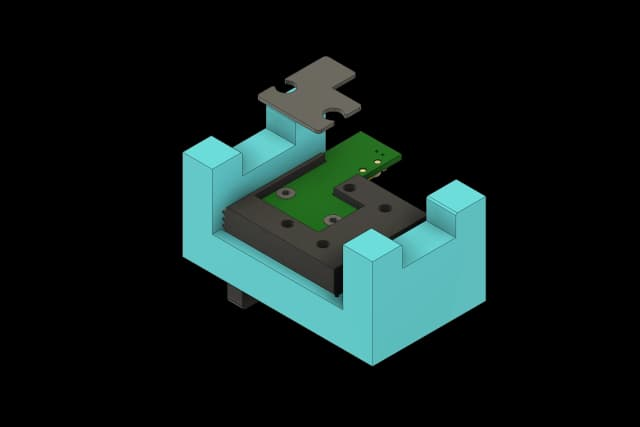](img/2/0001-53.png) | [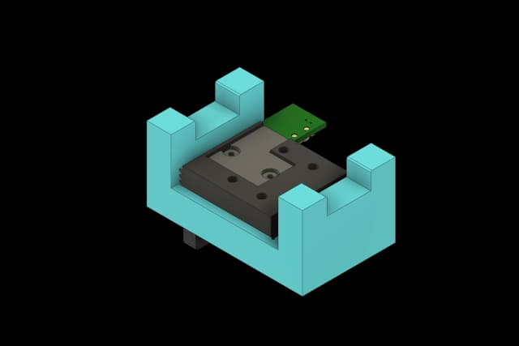](img/2/0001-22.png) |
|  |  |

### Load T-nuts
- Load M3 roll-in nuts into the 1030 extrusion.

| | |
|:-:|:-:|
| [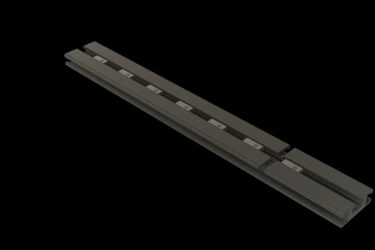](img/2/001-z-axis-assembly.png) |  |

### Install the Linear Rail onto the Extrusion
- Put the linear rail on top of the extrusion and align the preloaded nuts with the holes of the linear rail.
- The kit comes with greased rails from batch 2. If you find your rails are not greased, remember to grease it beforehand. How to check if it is greased: Wipe the rail gently with a clean cloth or tissue. If it feels slightly oily or you see a thin, shiny layer on the surface, the rail is greased. If it looks dry or the cloth stays clean, it likely needs lubrication.
- Use alignment jigs to help you position the linear rail. Install M3x8 SHCS screws and leave them slightly loose in order to adjust them later on.
- There should be no screw in the first and last hole of the linear rail.
- Insert the M6x23 thumb screw in the first (large) hole to help position the linear and extrusion.
- Tighten all the screws. Remember to tighten the screws from the middle outwards.

| | |
|:-:|:-:|
| [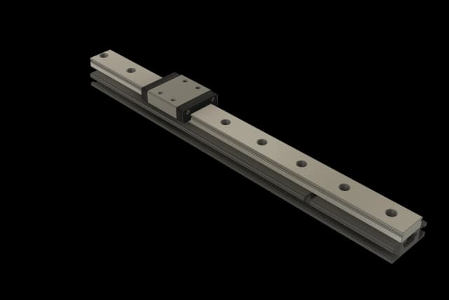](img/2/002-z-axis-assembly.png) | [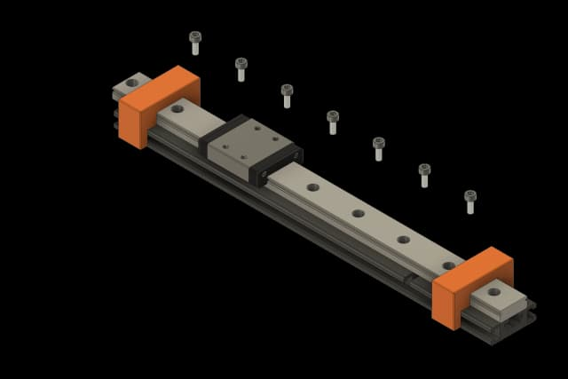](img/2/003-z-axis-assembly.png) |
| [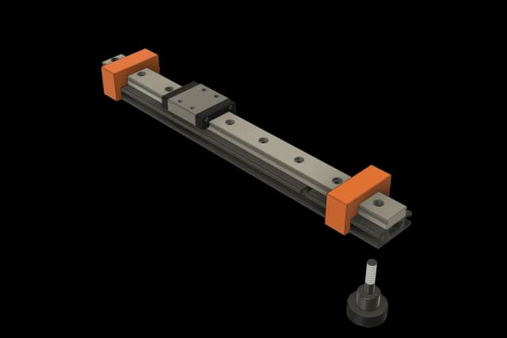](img/2/004-z-axis-assembly.png) | [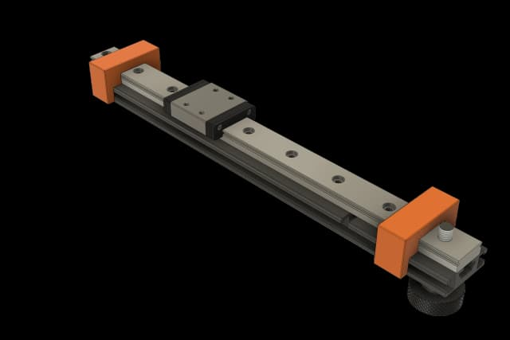](img/2/005-z-axis-assembly.png) |

### Install the Bed Carriage Block
- Attach the bed carriage block onto the carriage block of the linear rail and secure with M3x12 SHCS screws.

| | |
|:-:|:-:|
| [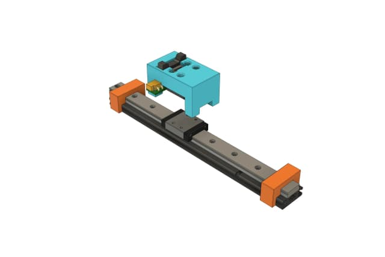](img/2/block-1.png) | [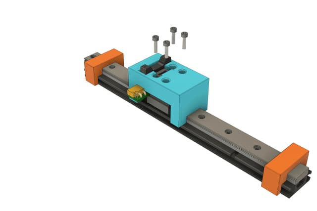](img/2/block-2.png) |
| [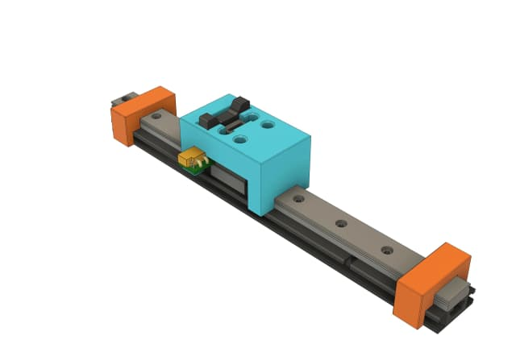](img/2/block-3.png) |  |

### Install the Z Belt Retainer Block
- Self-tap two M3x10 SHCS into the holes of the printed part.
- Position the Z belt retainer block to the left side of the bed carriage block and align the holes. Secure with M2.5x14 BHCS screws.

| | |
|:-:|:-:|
| [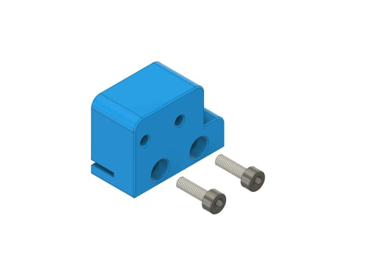](img/2/block-6.png) | [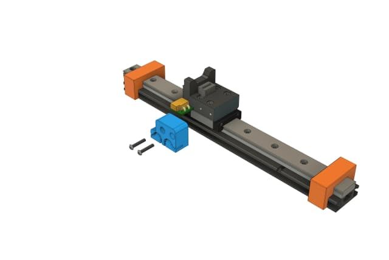](img/2/block-4-1.png) |
| [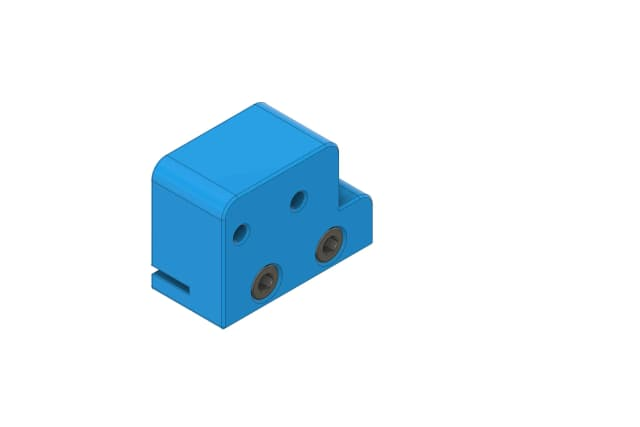](img/2/block-7.png) | [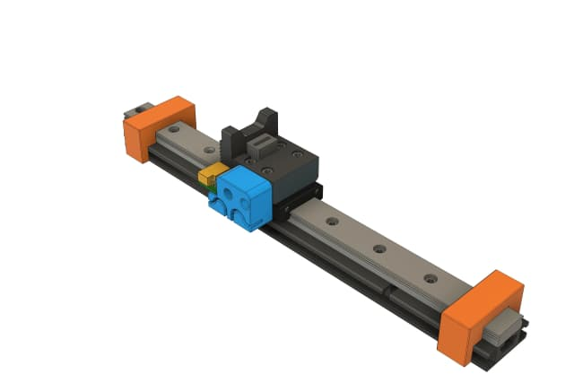](img/2/block-5-1.png) |

### Install the Z Sliding Idler Block
- Preload an M4 hex nut on the positon about 88mm from the edge of the extrusion.
- Slide the pivot into the extrusion. Thread a M3x10x1 wahser though the M3x12 wafer head screw. Align the tension arm and the pivot and tighten the screw.
- Align the M4 hex nut and the hole of the printed Z tension stop. Secure with an M4x10 BHCS screw.
- Insert the 0.7x5x50mm spring and the Z sliding idler block into the extrusion.

| | |
|:-:|:-:|
| [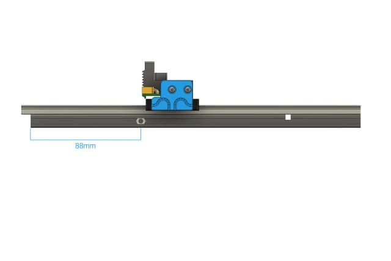](img/2/000-2.png) | [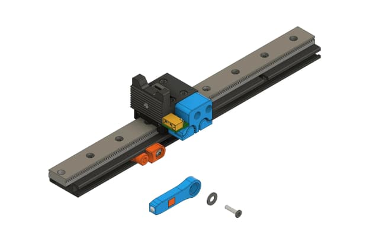](img/2/003-2.png) |
| [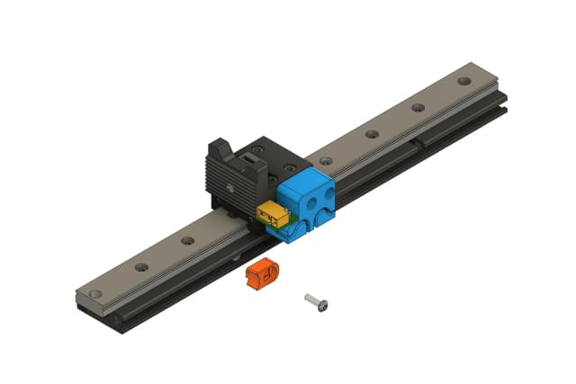](img/2/001-5.png) | [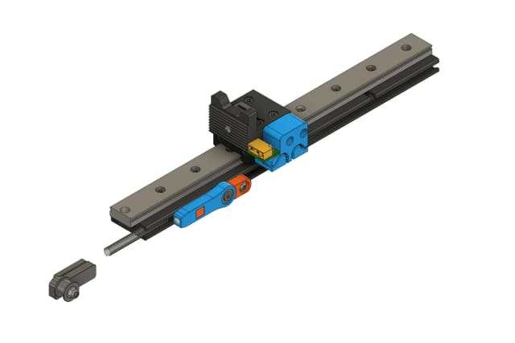](img/2/005-2.png) |
| [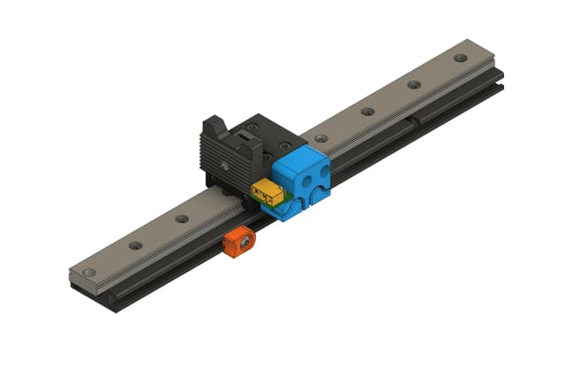](img/2/002-2.png) | [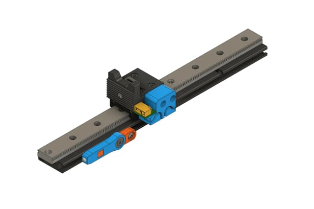](img/2/004-3.png) |
| [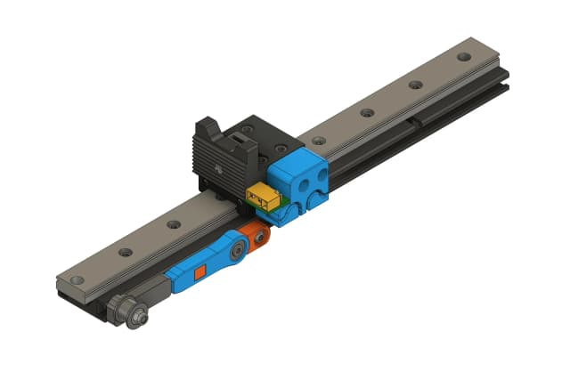](img/2/006-2.png) |  |

### Install the Z Top Stopper
- Position the stopper to the linear rail and secure with an M3x12 SHCS screw.

| | |
|:-:|:-:|
| [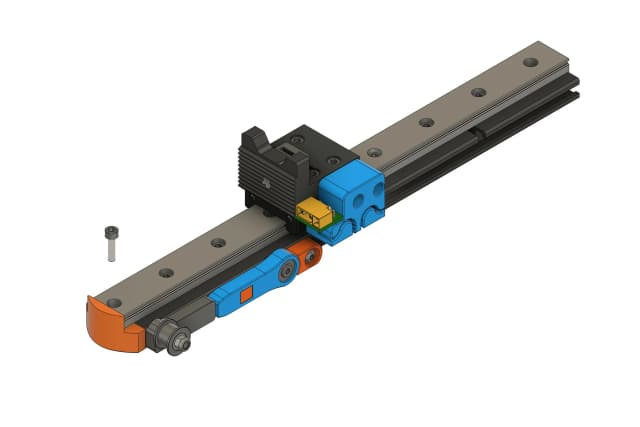](img/2/007-2.png) | [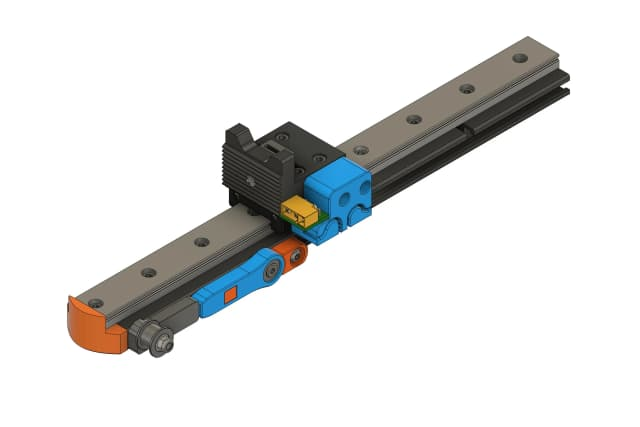](img/2/008-2.png) |

### Install the Left Z Joint Plate
- Preload three M4 hex nuts into the extrusion.
- Aligh the holes of the right Z joint plate with preloaded hex nuts and secure with M4x10 BHCS screws.

| | |
|:-:|:-:|
| [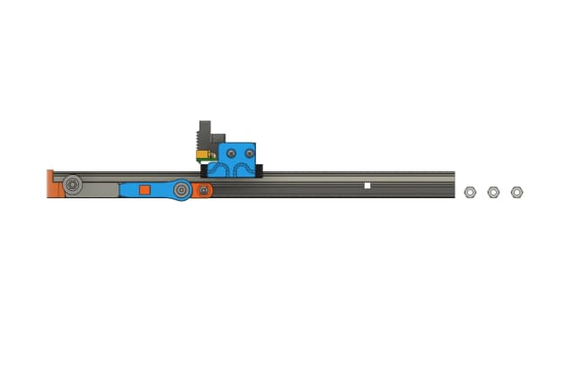](img/2/009.png) | [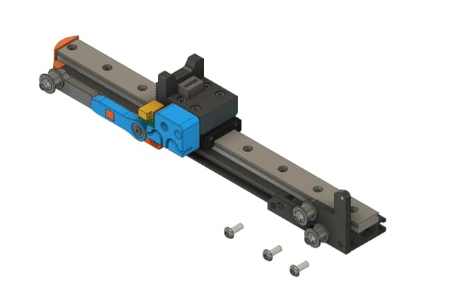](img/2/011-1.png) |
| [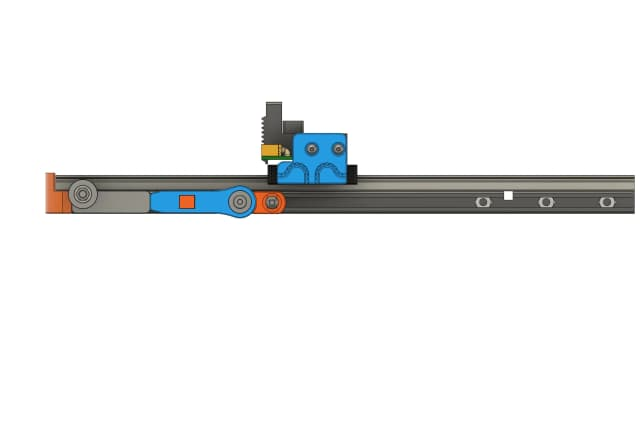](img/2/010-1.png) | [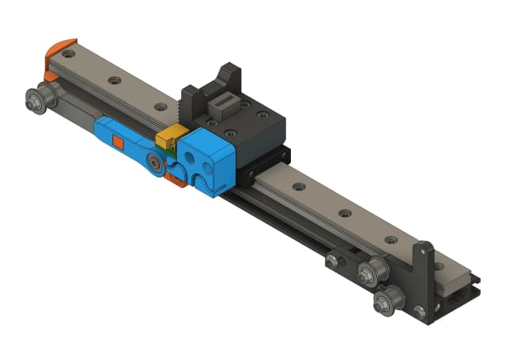](img/2/012-3.png) |

### Insert the Bed Cable Guide
- Insert the printed bed cable guide into the extrusion. And preload M4 hex nuts into the slot of the extrusion.

| | |
|:-:|:-:|
| [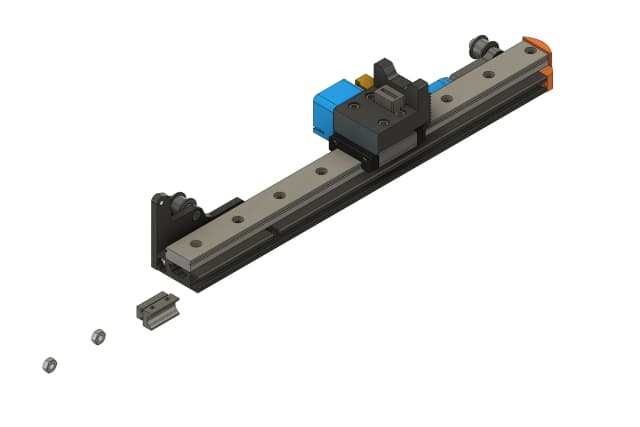](img/2/013-2.png) | [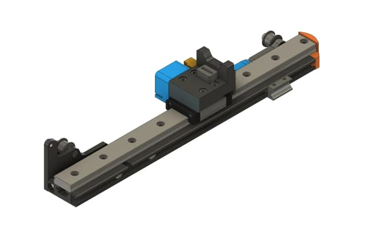](img/2/014-2.png) |

### Install the Extruder
- Refer to the picture for installation spot. The bottom of the printed part should be 30mm away from the extrusion end. Secure the extruder to the extrusion using M4x10 BHCS screws.

| | |
|:-:|:-:|
| [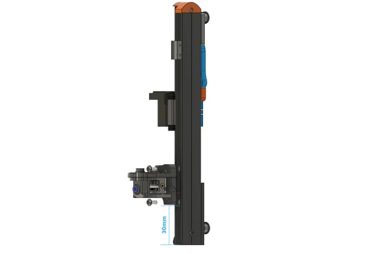](img/2/015-3.png) | [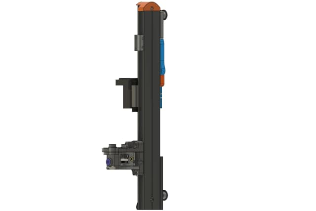](img/2/016-2.png) |

### Assembly Complete
- You now have completed the assembly of the Z Column.
- We will install the motor in a later step.

| | |
|:-:|:-:|
| [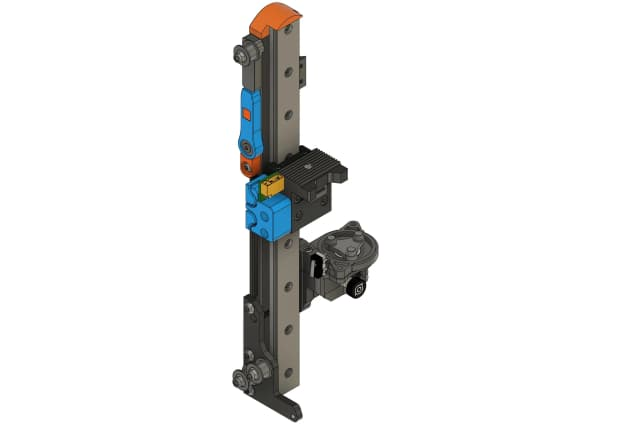](img/2/017-2.png) |  |
---
**Previous:** [1 - Extruder](1_positron_3.2_extruder.md) &nbsp;|&nbsp; **Next:** [3 - Z Drive](3_positron_v32_z-drive.md)
