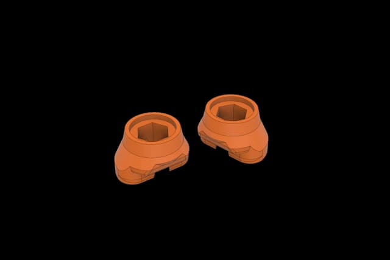
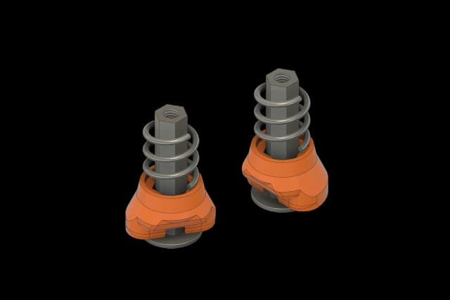
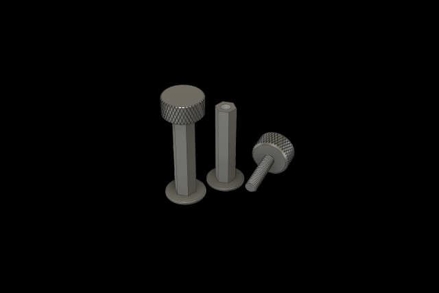
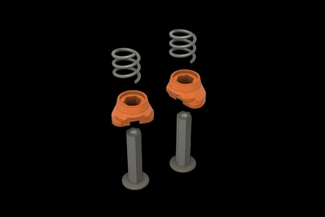
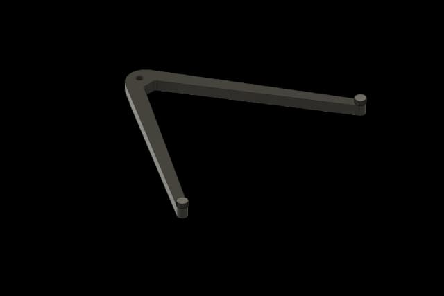
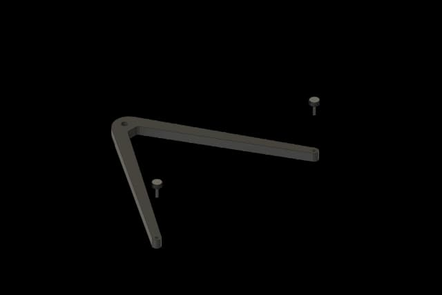
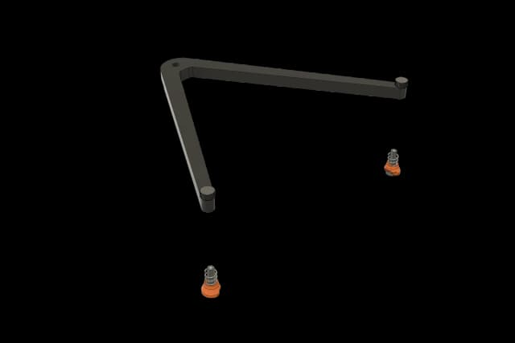
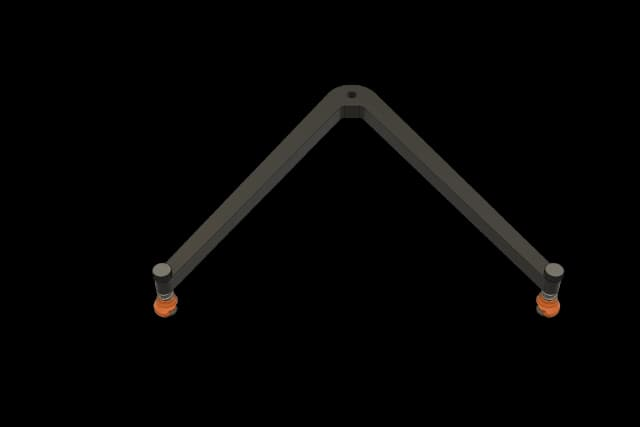
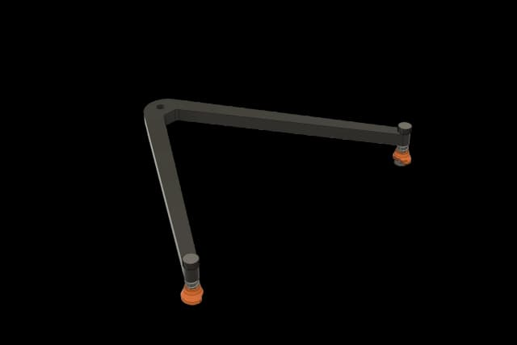

# 4 - Positron V3.2 - Bed V Holder

This guide contains instructions for building the bed V holder for the Positron V3.2.

> Original: [LDO Motion Guide](https://ldomotion.com/guides/4---positron-v32---bed-v-holder)

## 1. Parts to print

### Printed parts

- Bed Spring Retainer Ring x2 (Remember to remove the printed support.)
  - 
  [Large](img/4/0001-11.png)

## 2. Installation

### Assemble the Standoffs

- When you receive the parts, they are pre-assembled as shown in the picture. Please unscrew the M3x12 thumbscrews first.
- Install the bed spring retainer rings and the springs onto the standoffs.
  - 
  [Large](img/4/0005-1.png)
  - 
  [Large](img/4/0003-6.png)
  - 
  [Large](img/4/0004-5.png)

### Install the Thumbscrews

- Insert M3x12 thumbscrews into the holes of the bed V holder.
- Check the orientation of the V holder so that the side with the ridges should face down.
  - 
  [Large](img/4/0002-7.png)
  - 
  [Large](img/4/0002-8.png)

### Fasten the Standoffs

- Attach the assembled standoffs to the thumb screws and tighten the thumbscrews.
- Leave the opening of the retainer ring inward facing each other.
  - 
  [Large](img/4/0006.png)
  - 
  [Large](img/4/0007-1.png)

### Assembly Complete

- Now you have completed the assembly of the bed V holder.
  - 
  [Large](img/4/0008-10.png)

