# 5 - Positron V3.2 - Touch Panel
This guide contains instructions for building the touch panel for the Positron V3.2.

> Original: [LDO Motion Guide](https://ldomotion.com/guides/5---positron-v32---touch-panel)

---
**Previous:** [4 - Bed V-Holder](4_positron_v32_bed-v-holder.md) &nbsp;|&nbsp; **Next:** [6 - Toolhead](6_positron_v32_toolhead.md)

## 1. Parts to Print

> Before you start to assemble the touch panel, please make sure you have these parts printed.

### Printed Parts
- Touch Enclosure x1
- Cover Stand x1
- Back Plate x1

| | |
|:-:|:-:|
| [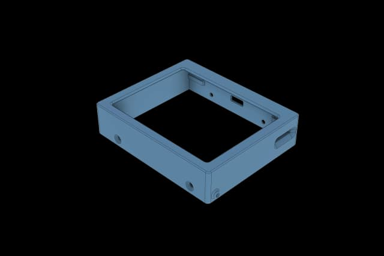](img/5/0001-54.png) | [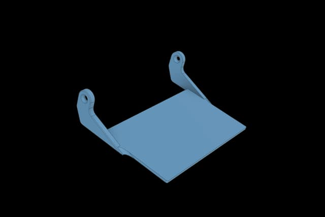](img/5/0002-3.png) |
| [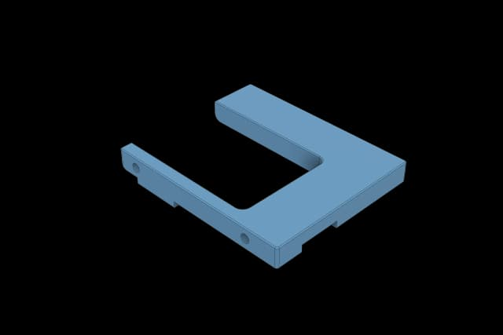](img/5/0003-13.png) |  |

### Preparation for the Printed Part
- Install M2.5x3x4 heatset inserts into holes of the printed back plate.

| | |
|:-:|:-:|
| [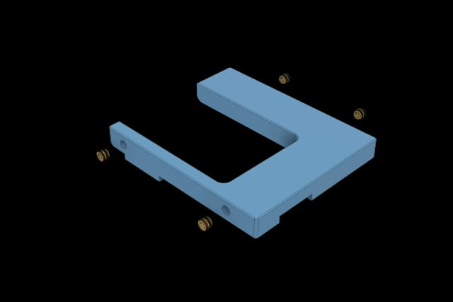](img/5/0003-5.png) | [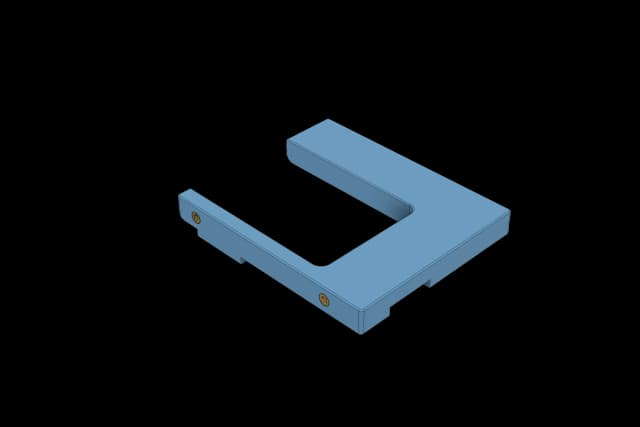](img/5/0003-15.png) |

## 2. Installation

> For all the M2.5 screws, please use our screwdriver included in the kit.

### Install the Wifi Antenna
- Remove the film on the screen.
- Then remove the adhesive on the surface of the wifi antenna and stick it to the printed back plate.

| | |
|:-:|:-:|
| [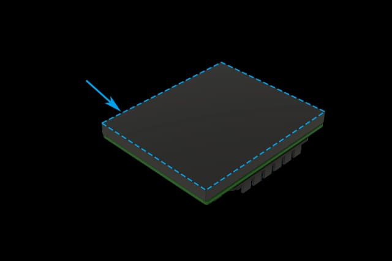](img/5/top-touch-panel.png) | [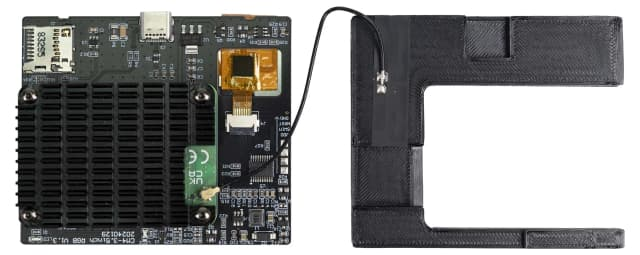](img/5/01-1.png) |

### Install the Touch Control
- Put the touch control into the touch enclosure and cover the back plate.
- Secure the cover with M2.5x6 FHCS screws.

| | |
|:-:|:-:|
| [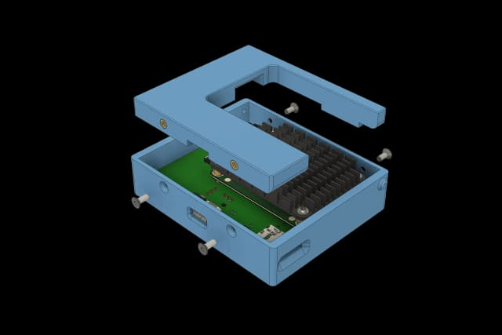](img/5/0003-11.png) | [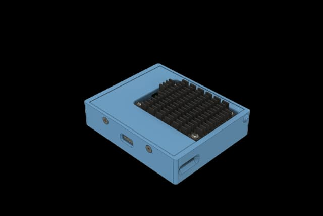](img/5/0003-8.png) |

### Assemble the Cover Stand
- Attach the printed touch enclosure and cover stand together and then secure with M2.5x6 FHCS screws.

| | |
|:-:|:-:|
| [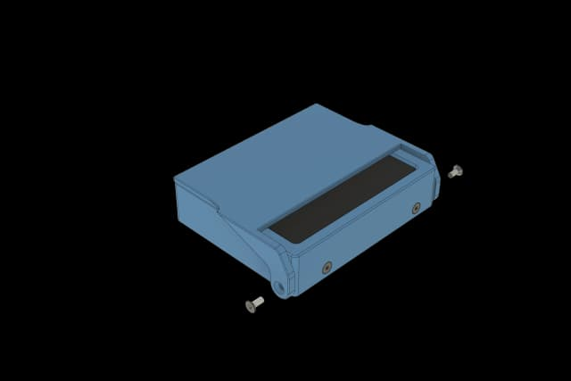](img/5/0003-9.png) |  |

### Install SD Card
- Put the SD card into the touch panel.
- The SD card has been flashed.

| | |
|:-:|:-:|
| [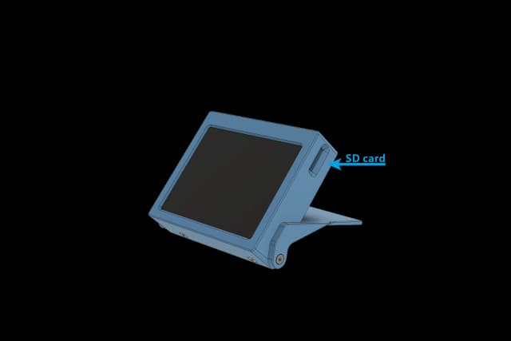](img/5/sdcard-1.png) |  |

### Assembly Complete
- Now you have completed the assembly of the touch panel.

| | |
|:-:|:-:|
|  |  |
---
**Previous:** [4 - Bed V-Holder](4_positron_v32_bed-v-holder.md) &nbsp;|&nbsp; **Next:** [6 - Toolhead](6_positron_v32_toolhead.md)
