# 6 - Positron V3.2 - Toolhead

This guide contains instructions for building the toolhead for the Positron V3.2.

> Original: [LDO Motion Guide](https://ldomotion.com/guides/6---positron-v32---toolhead)

## 1. Parts to Print

### Printed Parts

- Toolhead Belt Retainer Block x1
  - 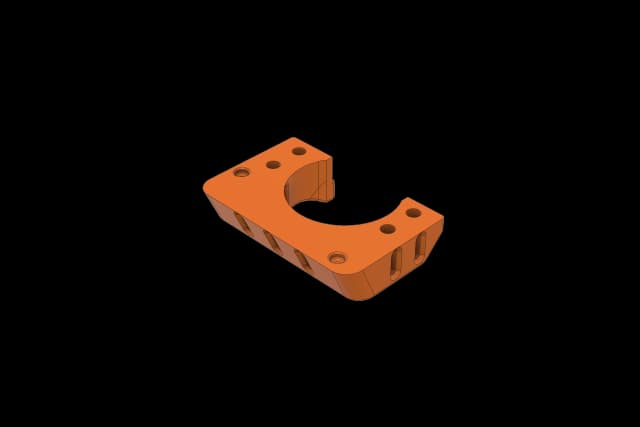
  [Large](img/6/0092-7.png)

### Preparation for the Printed Parts

- Install an M3x4x5 heatset insert into this hole.
- Install M2.5x3x4 heatset inserts into the holes of the printed toolhead belt retainer block.
  - 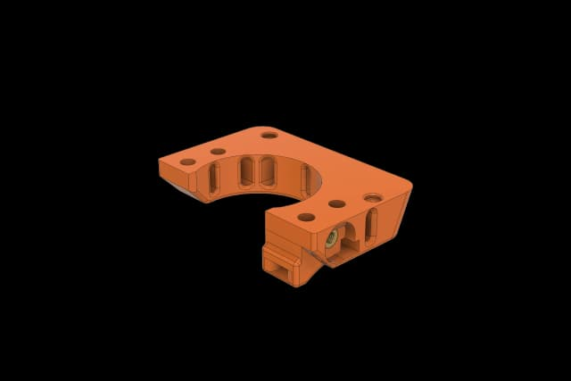
  [Large](img/6/0001-8.png)
  - 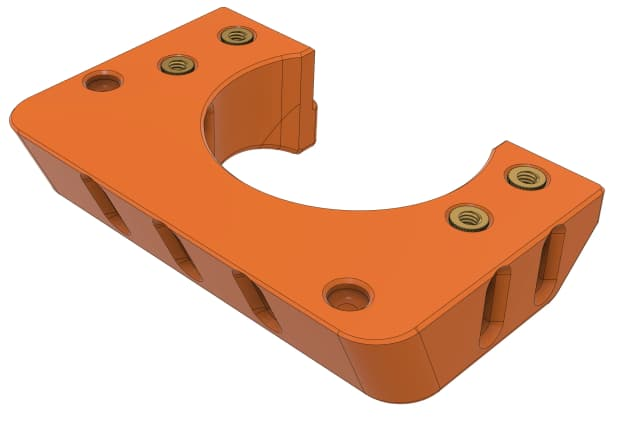
  [Large](img/6/0024-1.png)
  - 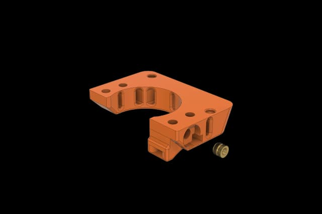
  [Large](img/6/0000-3.png)
  - 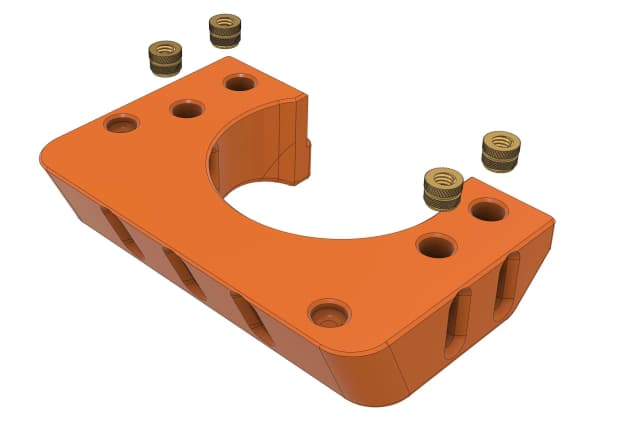
  [Large](img/6/0023.png)

## 2. Installation

### Prepare the Toolhead Base Plate

- Cover with the toolhead base plate and secure with M2.5x6 FHCS screws.
  - 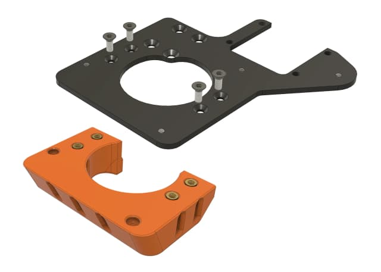
  [Large](img/6/0092-3.png)
  - 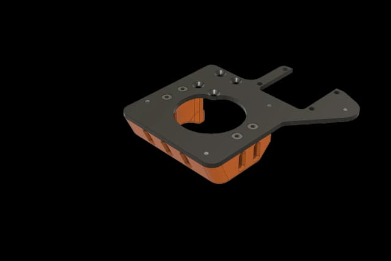
  [Large](img/6/0092-4.png)

### Install the Fan

- The hotend included in the kit is pre-assembled. Please double check the nozzle is fully fastened to avoid filament leakage during printing.
- Place the fan onto the heatsink and align the holes. Secure with M2.5x14 wafer head screws.
- The wire of the fan should go as shown in the picture.
  - 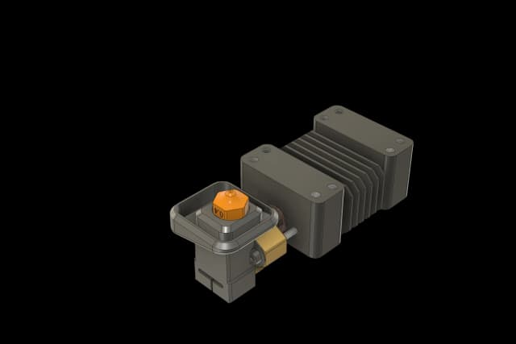
  [Large](img/6/assembly-1.png)
  - 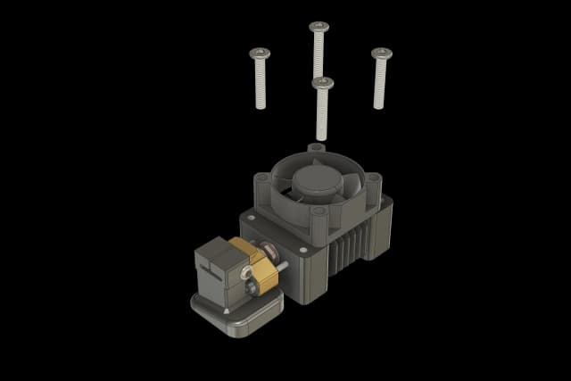
  [Large](img/6/assembly2-1.png)
  - 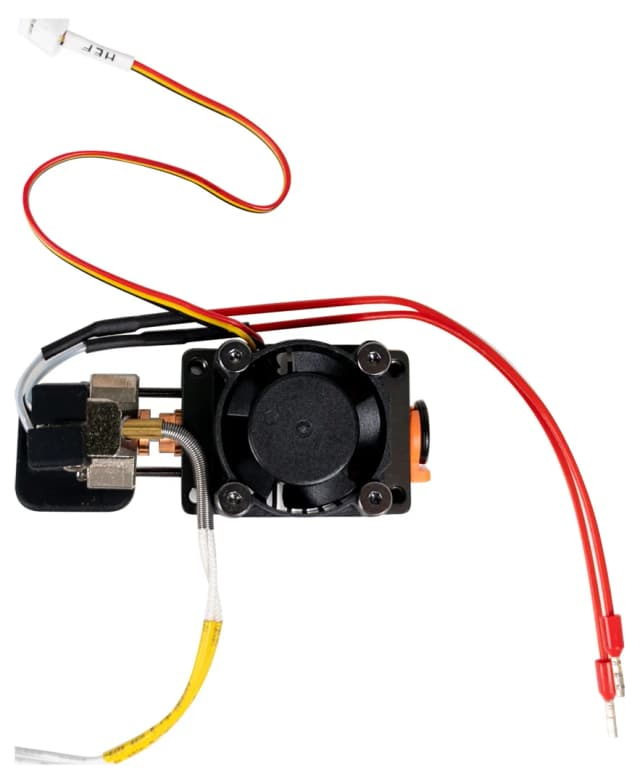
  [Large](img/6/assembly3-1.png)

### Install the Toolhead Base Plate

- Aligh the holes of the toolhead base plate with the holes of the heatsink and secure with M2.5x6 BHCS screws.
- The wire of the fan should go as shown in the picture.
  - 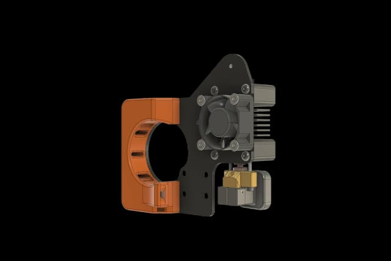
  [Large](img/6/assembly5.png)
  - 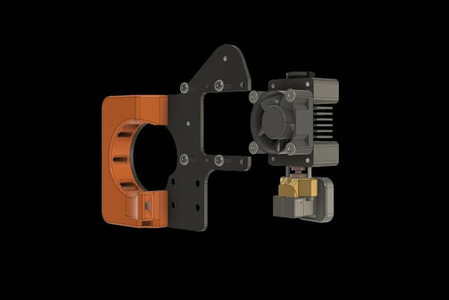
  [Large](img/6/assembly4.png)
  - 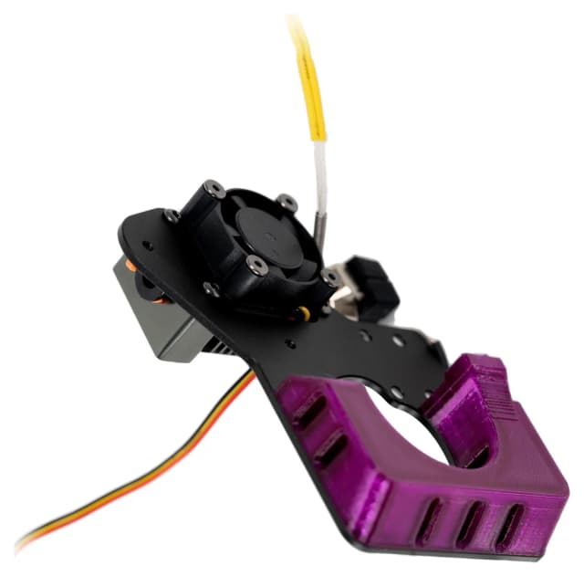
  [Large](img/6/fan-wire.png)

### Assembly Complete

- You now have completed the assembly of the toolhead.
- We will continue other steps later on.
  - 
  [Large](img/6/assembly5.png)

