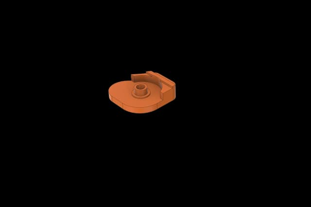
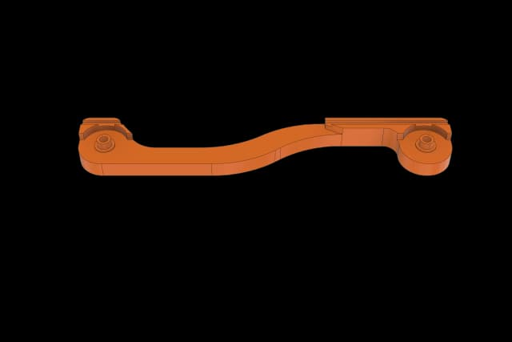
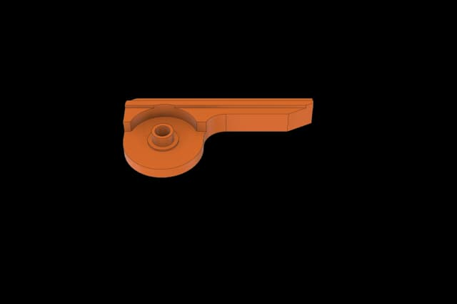
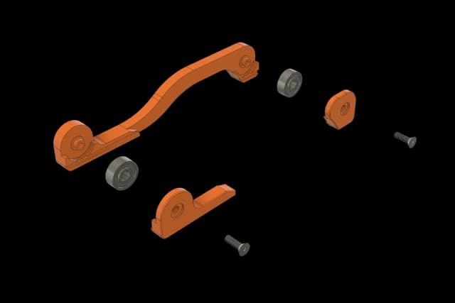
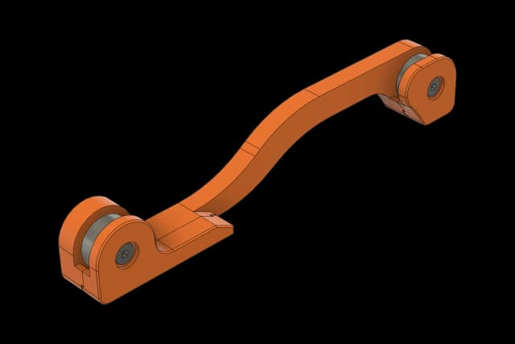
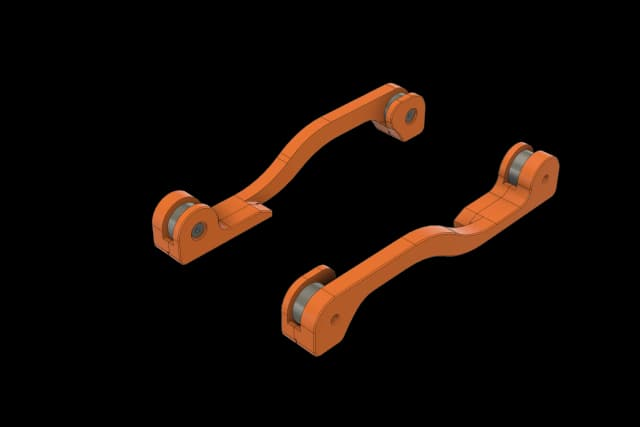

# 7 - Positron V3.2 - Spool Holder
This guide contains instructions for building the spool holder for the Positron V3.2.

> Original: [LDO Motion Guide](https://ldomotion.com/guides/7---positron-v32---spool-holder)

---
**Previous:** [6 - Toolhead](6_positron_v32_toolhead.md) &nbsp;|&nbsp; **Next:** [8 - Base Plate](8_positron_v32_base-plate.md)

## 1. Parts to Print

> Before you start to assemble, please make sure you have these parts printed.

### Printed Parts
- Spool Holder Part A x2
- Spool Holder Part B x2
- Spool Holder Part C x2

| | |
|:-:|:-:|
|  |  |
|  |  |

## 2. Installation

### Assemble the Spool Holder
- Position 605ZZ bearings between the spool holder part A, B and C as shown in the picture. Secure with M3x10 FHCS screws.
- Prepare two sets.

| | |
|:-:|:-:|
|  |  |

### Assembly Complete
- You now have completed the assembly of the spool holder.

| | |
|:-:|:-:|
|  |  |
---
**Previous:** [6 - Toolhead](6_positron_v32_toolhead.md) &nbsp;|&nbsp; **Next:** [8 - Base Plate](8_positron_v32_base-plate.md)
