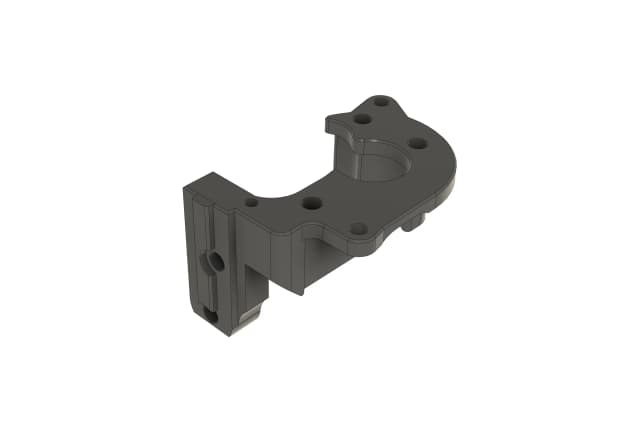

# LDO Motion Guides - Extraction Instructions

## Source

### All Guide URLs
- `https://ldomotion.com/guides/1---positron-v32---extruder` → `1_positron_3.2_extruder.md`
- `https://ldomotion.com/guides/2---positron-v32---z-column` → `2_positron_v32_z-column.md`
- `https://ldomotion.com/guides/3---positron-v32---z-drive` → `3_positron_v32_z-drive.md`
- `https://ldomotion.com/guides/4---positron-v32---bed-v-holder` → `4_positron_v32_bed-v-holder.md`
- `https://ldomotion.com/guides/5---positron-v32---touch-panel` → `5_positron_v32_touch-panel.md`
- `https://ldomotion.com/guides/6---positron-v32---toolhead` → `6_positron_v32_toolhead.md`
- `https://ldomotion.com/guides/7---positron-v32---spool-holder` → `7_positron_v32_spool-holder.md`
- `https://ldomotion.com/guides/8---positron-v32---base-plate` → `8_positron_v32_base-plate.md`
- `https://ldomotion.com/guides/9---positron-v32---final-assembly` → `9_positron_v32_final-assembly.md`
- `https://ldomotion.com/guides/10---positron-v32---folding` → `10_positron_v32_folding.md`
- `https://ldomotion.com/guides/heatset-insert-tool-guide` → `heatset_insert_tool.md`

- **Base image CDN**: `https://s3.ldomotion.com/ldomotion/media/`
- **Framework**: Next.js (uses `/_next/image` proxy for resizing)

## Page Structure
- Main title in `<h1>`
- Sections marked with numbered headings (e.g., "1. Parts to Print")
- Subsections under each section (e.g., "Printed Parts", "Install the Shaft...")
- Steps are list items with descriptions, some linked to images
- Images appear in blocks after step descriptions

## Image URLs
Each image has two variants served through Next.js CDN:
- **Preview (640w)**: `/_next/image?url=<encoded_s3_url>&w=640&q=75`
- **Large (828w)**: `/_next/image?url=<encoded_s3_url>&w=828&q=75`

Both resolve to the same raw S3 `.webp` file. The `w` parameter only controls CDN resize. Downloaded images are converted to `.png` for broader compatibility.

To download directly from S3, use the raw URL:
```
https://s3.ldomotion.com/ldomotion/media/<filename>.webp
```

## Caveats

### Spaces in filenames
Source images from S3 may contain spaces (e.g., `Extruder Main Body.webp`). When downloading, URL-encode spaces as `%20`. After download, rename all image files to lowercase with dashes instead of spaces:
- `Extruder Main Body.webp` → `extruder-main-body.png`
- `bowden coupler.webp` → `bowden-coupler.png`
- `top cover, left.webp` → `top-cover-left.png`
- Example download:
  ```bash
  curl -sL -o "$DIR/Extruder Main Body.webp" "https://s3.ldomotion.com/ldomotion/media/Extruder%20Main%20Body.webp"
  ```

### Next.js image proxy
The `src` attribute on `` tags points to `/_next/image?url=...`, not the raw S3 URL. Extract the `url` query parameter and decode it to get the actual S3 path.

### Image naming
Filenames are not sequential or consistent. Some have suffixes like `-1`, `-2`, etc. Always extract the actual filename from the `srcSet` or `url` parameter, don't guess. All stored filenames are lowercase with dashes (no spaces, no special characters).

### Markdown image format
Previews display inline; large link appears on the next line:
```markdown
- 
  [Large](img/1/extruder-main-body.png)
```

## Extraction Steps
1. Fetch the page HTML
2. Parse headings for section/subsection structure
3. Extract text content for steps/descriptions
4. Extract all `` tags, decode the `url` query param from `/_next/image` proxy
5. Download each image from S3 (both raw large and preview via CDN)
6. Build markdown with proper structure and links
