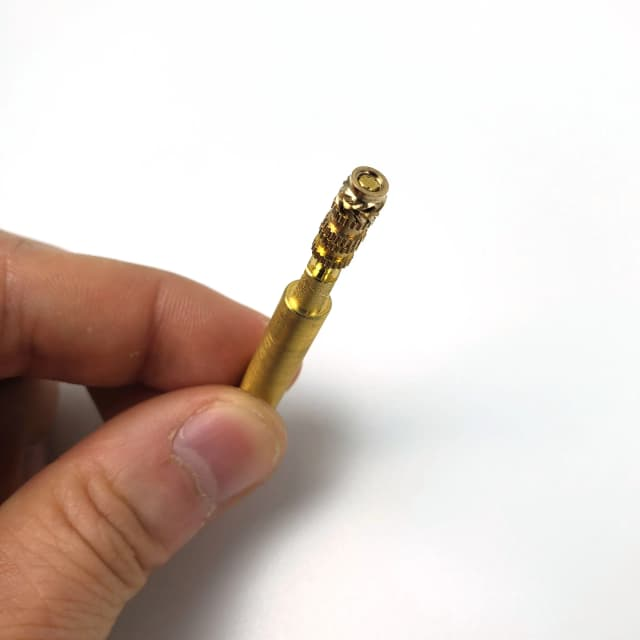
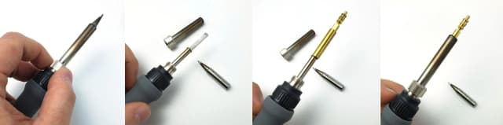

# Heatset Insert Tool Guide
Brass inserts are a popular way to add strong and reliable threaded holes to 3D printed parts. These brass inserts are typically installed using a soldering iron. For beginners, installing these parts can be a nerve-wracking experience, as a bad install will ruin a part that took hours to print. Inspired by this hackaday guide , LDO developed the Heatset Insert Tool to make the process of installing a brass insert a simple (and dare we say, fun) experience.

> Original: [LDO Motion Guide](https://ldomotion.com/guides/heatset-insert-tool-guide)

---
**Index:** [README](README.md) &nbsp;|&nbsp; **Next:** [1 - Extruder](1_positron_3.2_extruder.md)

## 1. Heatset Insert Tool

### Adjustment
- The heatset tool we provide is designed to be used with M3 brass inserts (other sizes may be developed in the future). The tool has a tongue that can be adjusted according to the height of the insert to be used. To adjust the tongue, move the adjustment nuts up or down until the length of the exposed tongue is about the same as the height of the insert. Having a correct tongue length is important as it ensures the maximum amount of heat transfer between the insert and the tool while preventing the tip of the tongue from making direct contact with your printed part.

| | |
|:-:|:-:|
|  |  |

### Installing the Tool
- Our heatset insert tool is designed to be compatible with typical sleeved soldering irons available on the market (Look for a thumb ring at the root of the sleeve). To install the tip, simply unscrew the sleeve of your iron and replace the original tip with the insert tool

| | |
|:-:|:-:|
|  |  |

### Using the Tool
- Turn on your soldering iron, if the iron is temperature adjustable, set it to a suitable temperature - you will want to set it to a temperature that isn't so low that it requires too much force to push the insert down, but not so high that the temperature liquifies the plastic. Ideally, the temperature of the iron should cause the plastic to become very soft but not runny. If the part is properly designed (all Voron printed parts are), you should be able to place the narrow end of the insert partially inside the hole. Then simply push the insert down using the tool until it is flush with the part surface. A few things to keep in mind: Do not leave the iron in the part for too long, the plastic will eventually become runny and warp. Constantly check to ensure that you are pushing down at the correct angle. If you find that the angle is wrong, you can use the iron to nudge the insert - but do not leave it in for too long! Try not to leave the iron turned on for longer than it needs to be - the brass tool will eventually start to oxidize when heated for long periods. Use the trick mentioned in the hackaday guide : push the insert 90% in, then use a flat tool to press the insert the rest of the way in.
---
**Index:** [README](README.md) &nbsp;|&nbsp; **Next:** [1 - Extruder](1_positron_3.2_extruder.md)
